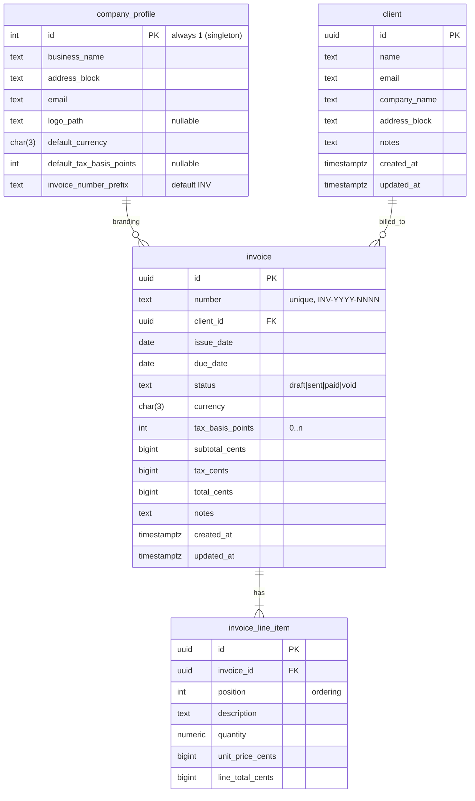
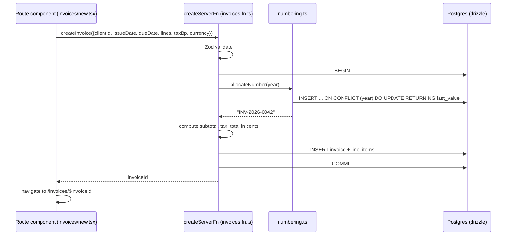
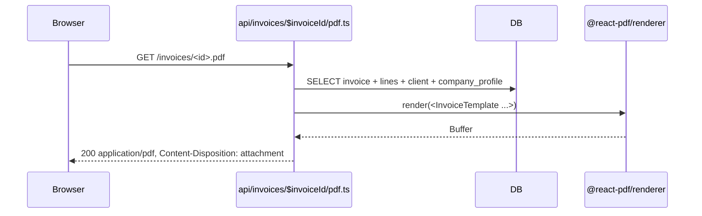

# MVP open-source invoicing app — foundation

## Overview

This plan stands up the **Community Edition** of an open-source invoicing app — a single AGPL-3.0 repo, deployable via Docker Compose, that runs locally on the maintainer's own infra. The MVP scope is intentionally tiny: no authentication, CRUD for clients and invoices, PDF download. Auth, public viewable links, email send, payment links, tracking, and the monthly-income chart are deferred to follow-up plans inside this same repo.

A hosted SaaS counterpart is **explicitly out of scope** for this plan and for this repo. When (if) it is built, it will live in a **separate private overlay repo** that consumes this one as a dependency (git submodule or npm dependency), not as a fork. Sync direction is one-way OSS → SaaS via dependency bumps. This avoids the divergence cost of bidirectional sync, which is a real problem the day you have two repos and not before. Treat every feature in this repo as Community Edition first; never embed hosted-only concerns (billing UI, multi-tenancy scaffolding) in core.

The stack is **TanStack Start v1 + Vite + TypeScript + PostgreSQL + Drizzle ORM + @react-pdf/renderer**, with Tailwind + shadcn/ui for the interface. License is **AGPL-3.0** with a **DCO sign-off** policy on contributions (no CLA). Self-hosters (and the maintainer locally) install via a single `docker compose up`.

## Problem Frame

The maintainer needs a simple, locally-runnable invoicing app: create clients, create invoices, download PDFs to email manually. Existing OSS options exist (InvoiceShelf, Invoice Ninja) but are Laravel-shaped and feature-heavy. Hosted SaaS like Hiveage is closed-source and not self-hostable. The maintainer wants something small, modern, and TypeScript-native that they own and run on their own infra.

The longer-term ambition is to grow this into a published OSS project that other small businesses, freelancers, and agencies adopt as a self-hosted invoicing tool — and, eventually, into a hosted SaaS run as a private overlay on top of the same code. Both of those are downstream of this MVP.

This MVP is intentionally tiny and **honest about who it serves**: the first user is the maintainer themselves, running it on localhost. It must produce a real PDF invoice for a real client end-to-end (creation, then download), with no auth and no email send. The next iteration brings auth + email + a public link, at which point external self-hosters become viable users. The hosted SaaS comes later still and lives outside this repo.

Locking the right things at MVP — license, distribution shape, data model, PDF pipeline, schema invariants that survive contact with multi-tenancy — is what makes the next iterations cheap. Calling this "the foundation" is shorthand for that, not a claim that the schema is permanent.

## Requirements Trace

- **R1.** A single user (no auth) can create, view, edit, and delete clients.
- **R2.** A single user can create, view, edit, and delete invoices, picking from existing clients.
- **R3.** Invoices have at least one line item with description, quantity, and unit price; subtotal and total are computed automatically.
- **R4.** A user can download any invoice as a PDF.
- **R5.** A user can edit a singleton "company profile" used to brand outgoing invoices (their own business name, address, optional logo).
- **R6.** The app is licensed AGPL-3.0 and ships with a DCO contributor policy.
- **R7.** A self-hoster can `git clone`, copy `.env.example` to `.env`, and run `docker compose up` to get a working installation backed by Postgres.
- **R8.** All money math is precise — no floating-point drift in totals.

## Scope Boundaries

- **No authentication.** No login screen, no users table, no sessions. Self-hosters protect access at the network layer (reverse proxy, VPN, basic auth in front). The hosted SaaS is not yet stood up.
- **No multi-tenancy.** Single tenant per database. Multi-tenancy is a follow-up plan, not a refactor under this one.
- **No email send.** No SMTP, no Resend integration. PDF download only.
- **No payment links.** No Stripe, no checkout.
- **No income chart, no analytics view.** Even though the original brief mentioned a monthly income overview, it falls out of the user-defined MVP and is deferred.
- **No recurring invoices, no estimates/quotes, no team members.**
- **No public invoice view URL** — invoices are only viewable through the admin UI. A signed public link is a follow-up.
- **No tracking** — no "viewed", "sent", or "delivery" timestamps yet. The `status` field is a manual flag, not telemetry.

### Deferred to Separate Tasks

The following all stay **inside this repo**, in subsequent Community Edition plans:

- **Auth + multi-user accounts**: separate plan, planned next iteration.
- **Public invoice view link + tracking**: separate plan, planned alongside auth.
- **Email invoice / send via SMTP or Resend**: separate plan.
- **Stripe payment links + mark-paid webhooks**: separate plan.
- **Monthly income overview chart**: separate plan, depends on `paid_at` being populated.

The following lives **outside this repo**, in a future private overlay:

- **Hosted SaaS deployment, billing, multi-tenant infrastructure, marketing site, customer support tooling**: separate private repo built when (if) the SaaS is stood up. Consumes this repo as a dependency. Sync direction is one-way OSS → SaaS via version bumps. No bidirectional sync; the overlay never modifies core.

## Context & Research

### Relevant Code and Patterns

The repository is empty. There are no local patterns to follow yet — this plan establishes them. Subsequent plans should follow the conventions this work introduces:

- Co-locate server-only modules under `src/server/` and keep them out of route components except via `createServerFn`.
- Schema lives in a single `src/server/schema.ts` Drizzle module to keep contributor barrier low.
- Money is integer minor units; quantities are `numeric(10,2)`. Computed totals are stored, not derived at read time.
- React server functions own validation (Zod schemas), persistence, and any side effects. Route components only call them.

### Institutional Learnings

No prior `docs/solutions/` exist for this project. The first solutions doc should be written after the first non-trivial bug or migration this MVP produces.

### External References

Key research findings from the Phase 1 research pass (April 2026):

- **TanStack Start v1.0** released March 2026, ~6M weekly npm installs. `createServerFn` is the supported, stable server-function pattern. Pin to a specific 1.x and commit `package-lock.json`. ([release announcement](https://tanstack.com/blog/announcing-tanstack-start-v1), [hosting docs](https://tanstack.com/start/v0/docs/framework/react/guide/hosting))
- **`@react-pdf/renderer`** is the right PDF choice for an OSS app that prioritises easy self-hosting: pure JS, no Chromium, layout in JSX, fits invoice tables/headers/footers naturally. Headless Chromium adds 250–400 MB to the Docker image and brings sandboxing pain. ([react-pdf.org](https://react-pdf.org/))
- **Drizzle over Prisma**: ~7 KB gzipped vs Prisma's still-bulky generated client even after Prisma 7. Schema in one TS file lowers contributor friction. Raw SQL escape hatch (`sql\`...\``) handles invoice numbering with row locks cleanly. ([Drizzle vs Prisma](https://encore.dev/articles/drizzle-vs-prisma), [Drizzle migrations](https://orm.drizzle.team/docs/migrations))
- **License pattern**: AGPL-3.0 + **DCO sign-off** (not a CLA) keeps contributor friction low. Cal.com, Documenso, and Plausible all run AGPL-3.0 SaaS models. Important caveat: DCO certifies provenance, it does **not** transfer copyright. Once the project accepts non-trivial external contributions, a future relicense (e.g. to dual-license or to add a closed Enterprise Edition) requires permission from every copyright holder, or rewriting their contributions. Plausible's later switch to a CLA was driven by exactly this constraint, and is the cautionary tale on adding contributor agreements after the fact. The plan accepts this: AGPL is treated as the long-term license, not a placeholder. ([Cal.com AGPL switch](https://cal.com/blog/changing-to-agplv3-and-introducing-enterprise-edition), [Documenso licenses](https://docs.documenso.com/users/licenses/community-edition))
- **Docker Compose sharp edges**: run migrations as a separate one-shot service with `service_completed_successfully`; Postgres healthcheck must use `pg_isready` with a `start_period`; Vite inlines `VITE_*` at build time (server config must be runtime-only); HMR doesn't work in Docker dev — develop on host, containerise for prod. ([Docker depends_on healthchecks](https://oneuptime.com/blog/post/2026-01-16-docker-compose-depends-on-healthcheck/view))

## Key Technical Decisions

- **TanStack Start v1.x as the full-stack framework.** Type-safe routing, loaders, and server functions in one model. User explicitly excluded Next.js; TanStack Start is the strongest non-Next.js JS/TS option in 2026 with a single mental model end-to-end.
- **Drizzle ORM, not Prisma.** Smaller image, no codegen, raw SQL escape hatch when invoice numbering needs row locks. Schema-as-TypeScript keeps the contributor barrier low.
- **PostgreSQL 16.** Standard, well-understood, supported by every hosting platform self-hosters use.
- **`@react-pdf/renderer` for invoice PDFs.** Pure JS, no native deps, JSX-based layout. Avoids shipping Chromium in self-host images.
- **Tailwind CSS + shadcn/ui.** De-facto React component story in 2026; copy-in components stay in the repo and remain modifiable, no runtime CSS-in-JS.
- **AGPL-3.0 + DCO sign-off.** Single license, no CLA at MVP. README's License section makes the SaaS-vs-self-host model explicit. DCO keeps contributor friction low but **does not preserve relicensing rights** — once the project accepts external contributions, AGPL is effectively permanent without permission from every contributor. The decision is to treat AGPL as the long-term license. A CLA may be adopted later only if the project never accepts external contributions in the meantime; otherwise relicensing is off the table.
- **Money as integer minor units; quantity as `numeric(10,2)`.** All amount columns (`unit_price_cents`, `subtotal_cents`, `tax_cents`, `total_cents`, line `line_total_cents`) are Postgres `BIGINT`. Drizzle column mode is **`bigint`** (returns native `BigInt`), not `mode: 'number'` — `mode: 'number'` silently truncates above 2^53 and breaks `SUM()` aggregations once reporting features arrive. Quantity is `numeric(10,2)` and is parsed via `Decimal.js` (or equivalent) on the JS side; `node-postgres` returns `numeric` as a string by default, which **must not** be passed to `*` directly. Line totals are computed in cents at write time and stored — `line_total_cents = round(quantity_decimal × unit_price_cents)` — so list views never re-derive. The chosen rounding rule is **half-away-from-zero** (`Math.round` semantics), documented in `src/lib/money.ts`.
- **One currency per invoice, no FX.** Each invoice stores an ISO 4217 currency code; the company profile holds the default. No conversion logic in MVP.
- **Tax handled as a single optional flat percentage at invoice level** (not per line item). Stored as `tax_rate_basis_points` (integer, 100 = 1%) for precision; tax amount and total are computed and stored at write time. Per-line-item tax is a follow-up.
- **Status field on invoices** (`draft | sent | paid | void`). Manual, no enforcement, no automation. Cheap to include, useful immediately, avoids a schema migration later when auth/payments arrive.
- **Singleton company profile in the DB**, not in env vars. Editable from the Settings page; one row enforced via a `CHECK` or by always upserting `id = 1`. Logo stored on disk under a named `uploads` Docker volume; path persisted in the row.
- **Migrations run as a one-shot `migrate` service in Compose**, not on app startup. Deterministic, re-runnable, easier to debug failed migrations.
- **Vitest for unit tests; Playwright for one end-to-end "create invoice → download PDF" smoke test.** Integration coverage of the money math and the PDF round-trip is non-negotiable.

## Open Questions

### Resolved During Planning

- **PDF library**: `@react-pdf/renderer` with `renderToBuffer(<Doc />)` Node helper. Multi-page supported from day 1 via `<View wrap>` body and `<View fixed>` repeating header. PDF route lives at `src/routes/api/invoices/$invoiceId/pdf.ts` (TanStack Start API file route).
- **ORM**: Drizzle (Prisma rejected on Docker image and codegen friction).
- **License + contributor model**: AGPL-3.0 + DCO via the `dco-check` GitHub Action. **DCO does not preserve relicensing rights** — once external contributions land, AGPL is effectively permanent. Decision: treat AGPL as the long-term license.
- **Money representation**: integer minor units, BIGINT in schema, Drizzle `mode: 'bigint'` (native `BigInt`). Quantity is `numeric(10,2)` parsed via `Decimal.js`. Half-away-from-zero rounding rule, tested at boundaries.
- **Tax model**: single flat invoice-level rate stored in basis points; per-line-item tax deferred. **Known limitation**: insufficient for jurisdictions requiring per-line VAT/GST (most of EU/UK/CA/AU). Flagged in README so non-US users aren't surprised.
- **Currency model**: one ISO 4217 code per invoice, default from company profile, no FX in MVP.
- **Status field**: included in MVP as a manual flag with unconstrained transitions (any → any). Documented behaviour, not a state machine.
- **Company profile**: included in MVP (PDFs need a "from"). DB-backed singleton seeded at migrate time. No logo upload UI in MVP-1 — the column exists but the form omits the field entirely.
- **Migration execution**: `tsx scripts/migrate.ts` from a one-shot Compose `migrate` service (no separate compile step; `tsx` is in production deps).
- **Invoice numbering**: `INSERT ... ON CONFLICT (year) DO UPDATE SET last_value = last_value + 1 RETURNING last_value` inside the caller's transaction. Atomic, year-boundary safe.
- **Line-item cap**: hard cap of 100/invoice at the Zod layer.
- **Default network binding**: `127.0.0.1:3000:3000` (loopback). Operators must explicitly set `BIND_HOST=0.0.0.0` to expose. Mandatory startup banner warns about no-auth on every boot.
- **Database port**: no `ports:` mapping on `db` in prod compose; reachable only on Compose-internal network.
- **Logo path safety**: filenames only in `logo_path`, resolved against `UPLOADS_DIR` with path-traversal guard. Old file unlinked on update.
- **Security headers + CSRF defence**: middleware sets `X-Content-Type-Options`, `X-Frame-Options: DENY`, `Referrer-Policy`, baseline CSP. Origin/Referer check on mutating server fns.
- **PDF render concurrency**: in-process semaphore default 4, queue limit 16, returns 429 above. Tunable via `PDF_RENDER_CONCURRENCY`.
- **UI scope**: desktop-first, min viewport 1024×768. No mobile, no dark mode, no theming in MVP.
- **Validation/loading/toast pattern**: defined once in Unit 3, reused by Units 4 and 5. Field-level inline errors, disabled-with-spinner submit, success toast on save.
- **Logging in MVP**: plain `console.log`/`console.error`. Structured logger lands when there's a real consumer.
- **CI surface**: lint + typecheck + unit (Unit 1), Playwright e2e (Unit 6), `docker build` smoke + DCO action (Unit 8). No structured-logging tests.

### Deferred to Implementation

- **Exact Drizzle schema field names/lengths** — finalised during Unit 2 once Postgres docs and team conventions are checked.
- **PDF layout polish** — pixel-tweaking the invoice template (logo placement, address block, line-item table widths, exact Tailwind shades for status badges). Unit 6 nails the structure; visual polish can iterate.
- **Backup/restore docs for self-hosters** — `pg_dump`/`pg_restore` against the named `pgdata` volume + `tar` of the `uploads` volume. Written when Unit 8 puts the README together.
- **Concrete TanStack Start v1.x version** — pinned during Unit 1 against the version published the week of implementation. CI verifies the lock survives.

## Output Structure

```text
invoice-software/
├── src/
│   ├── routes/
│   │   ├── __root.tsx                    # layout, nav, error boundary
│   │   ├── index.tsx                     # dashboard / invoices list
│   │   ├── clients/
│   │   │   ├── index.tsx                 # clients list
│   │   │   ├── new.tsx
│   │   │   └── $clientId.tsx             # view + edit + delete
│   │   ├── invoices/
│   │   │   ├── index.tsx                 # invoices list
│   │   │   ├── new.tsx
│   │   │   ├── $invoiceId.tsx            # view + edit + delete
│   ├── routes/api/                       # API file routes (raw Response handlers)
│   │   └── invoices/
│   │       └── $invoiceId/
│   │           └── pdf.ts                # GET application/pdf via createServerFileRoute
│   │   └── settings.tsx
│   ├── server/
│   │   ├── db.ts                         # drizzle client + connection pool
│   │   ├── schema.ts                     # all tables in one place
│   │   ├── clients.fn.ts                 # createServerFn handlers
│   │   ├── invoices.fn.ts
│   │   ├── settings.fn.ts
│   │   ├── numbering.ts                  # invoice number allocator
│   │   └── pdf/
│   │       ├── invoice-template.tsx      # @react-pdf/renderer JSX
│   │       └── render.ts                 # render() that returns Buffer
│   ├── components/                       # shadcn/ui + project components
│   │   └── ui/                           # shadcn copy-ins
│   ├── lib/
│   │   ├── money.ts                      # cents <-> display, format
│   │   ├── currency.ts                   # ISO 4217 list + helpers
│   │   └── validators.ts                 # shared Zod schemas
│   └── styles.css                        # tailwind base
├── drizzle/                              # generated migration .sql files
├── tests/
│   ├── unit/
│   │   ├── money.test.ts
│   │   └── numbering.test.ts
│   └── e2e/
│       └── create-and-download-invoice.spec.ts
├── docker/
│   ├── Dockerfile                        # multi-stage
│   ├── entrypoint.sh
│   └── postgres-dev.yml                  # single-service: Postgres only, for host-side dev
├── docker-compose.yml
├── .env.example
├── .gitignore                            # excludes .env
├── drizzle.config.ts
├── vite.config.ts
├── tailwind.config.ts
├── components.json                       # shadcn config
├── tsconfig.json
├── package.json
├── package-lock.json
├── README.md                             # includes License section explaining AGPL + SaaS model
├── LICENSE                               # AGPL-3.0 full text
├── CONTRIBUTING.md                       # DCO, code conventions
├── CODE_OF_CONDUCT.md
└── docs/
    └── plans/
        └── 2026-04-30-001-feat-mvp-invoicing-app-plan.md
```

The implementer may adjust file placement if implementation reveals a better layout — the per-unit `Files:` lists remain authoritative.

## High-Level Technical Design

> *This illustrates the intended approach and is directional guidance for review, not implementation specification. The implementing agent should treat it as context, not code to reproduce.*

### Data model



### Request shape — create invoice



### Request shape — download PDF



## Implementation Units

- [x] **Unit 1: Project scaffold + tooling**

**Goal:** Bootstrap a runnable TanStack Start v1 + Vite + TypeScript + Tailwind + shadcn project with Vitest configured, lint/format wired, and an empty home route that renders.

**Requirements:** R7 (foundation for self-host), implicit foundation for R1–R6.

**Dependencies:** None.

**Files:**
- Create: `package.json`, `package-lock.json`, `tsconfig.json`, `vite.config.ts`, `tailwind.config.ts`, `postcss.config.js`, `components.json`
- Create: `src/routes/__root.tsx`, `src/routes/index.tsx`, `src/styles.css`
- Create: `.gitignore`, `.editorconfig`, `.nvmrc` (Node 22 LTS)
- Create: `.github/workflows/ci.yml` (lint + typecheck + unit tests on push)
- Create: `tests/unit/smoke.test.ts`

**Approach:**
- Use the official TanStack Start v1 template (`npm create @tanstack/start@latest`), pin to a specific 1.x in `package.json`, then commit `package-lock.json`.
- Configure `tsconfig.json` with `strict: true`, `noUncheckedIndexedAccess: true`, `verbatimModuleSyntax: true`.
- Initialise Tailwind, install shadcn/ui CLI, copy in only the components used (Button, Input, Label, Select, Table, Card, Toaster, Form). Do not pull the whole library.
- Add `eslint` (TS rules) + `prettier`. Single-source-of-truth config.
- Vitest runs in jsdom for components, node for server modules — split via `vitest.config.ts` `projects`.

**Patterns to follow:**
- TanStack Start v1 official scaffold defaults.
- Co-locate `*.test.ts` next to source for component tests; integration tests under `tests/`.

**Test scenarios:**
- *Happy path:* `npm run dev` boots and the home route renders "Invoicing" headline.
- *Happy path:* `npm run build && npm run start` produces and serves a production build.
- *Happy path:* `npm run typecheck` passes with no errors.
- *Happy path:* `npm run test` runs the smoke unit test green.

**Verification:**
- A fresh clone, `npm ci`, `npm run dev` reaches a working `http://localhost:3000` in under 30s.
- CI workflow runs lint, typecheck, and unit tests on `push` and `pull_request`.

---

- [x] **Unit 2: Database schema, Drizzle setup, migrations pipeline**

**Goal:** Define the full MVP schema in one Drizzle module, generate the initial migration, and wire a `migrate` runner that the app and Compose use. Unit 2 provides the schema substrate that Units 3, 4, and 5 build features on; the actual UI/server-fn satisfying each requirement lives in those units.

**Requirements:** Schema substrate for R1, R2, R3, R5, R8 (UI satisfying R5 lives in Unit 3; UIs satisfying R1, R2, R3 live in Units 4 and 5).

**Dependencies:** Unit 1.

**Files:**
- Create: `src/server/db.ts`, `src/server/schema.ts`
- Create: `drizzle.config.ts`
- Create: `drizzle/0001_init.sql` (generated)
- Create: `scripts/migrate.ts`
- Create: `tests/unit/schema.test.ts`

**Approach:**
- One file `src/server/schema.ts` defines: `companyProfile`, `client`, `invoice`, `invoiceLineItem`, `numberSequence`.
- All business tables use UUID primary keys (`uuid_generate_v4()`); singleton `company_profile.id` is `integer` and constrained to `1` via `CHECK (id = 1)`. The singleton constraint is **temporary** — when multi-tenancy lands, the constraint is dropped, an `account_id` FK is added, and `company_profile` becomes one-row-per-tenant. This is documented as a planned deletion to avoid surprise in v2.
- All money columns (`unit_price_cents`, `subtotal_cents`, `tax_cents`, `total_cents`, `line_total_cents`) are `BIGINT` with Drizzle `mode: 'bigint'`. Quantity is `numeric(10,2)` — pg returns this as a string, parsed via `Decimal.js` before any arithmetic.
- `invoice.number` is `text NOT NULL UNIQUE` (single-tenant MVP). The unique constraint will be reshaped to `(account_id, number) UNIQUE` in v2; documented now to make the v2 migration cheap.
- `numberSequence` table holds `(year integer PK, last_value integer NOT NULL)` rows. The allocator uses `INSERT ... ON CONFLICT (year) DO UPDATE SET last_value = number_sequence.last_value + 1 RETURNING last_value` — atomic, handles the year-boundary first-allocation case, no `SELECT ... FOR UPDATE` needed. (See Unit 5.)
- **Multi-tenant forward-compat note**: the schema deliberately uses UUID PKs, no `account_id` columns yet, and no row-level security. When v2 lands, `account_id uuid NOT NULL` is added to every business table with `DEFAULT NULL` during migration backfill, then `ALTER ... SET NOT NULL`. No PK reshaping required because UUIDs are already globally unique. RLS policies are added at that time.
- `created_at`, `updated_at` on every mutable table; `updated_at` maintained via a Postgres trigger so application bugs never leave a stale value.
- `drizzle.config.ts` reads `DATABASE_URL` from env and writes migrations to `drizzle/`.
- `scripts/migrate.ts` is a small entry point that runs `migrate({ migrationsFolder: 'drizzle' })`. Executed via `tsx` in production (added to runtime deps, not just dev) so the same `.ts` file works locally, in CI, and inside the Compose `migrate` service. No separate compile step. Document the `tsx scripts/migrate.ts` invocation in both Unit 7 and `package.json` scripts (`"db:migrate": "tsx scripts/migrate.ts"`).
- `src/server/db.ts` exports a singleton `pg` Pool + `drizzle()` instance, with `process.env.DATABASE_URL` validated on import (fail fast if missing). The validator must **not** echo the URL value in error messages — only confirm absence.

**Patterns to follow:**
- Drizzle's documented production migration pattern ([orm.drizzle.team](https://orm.drizzle.team/docs/migrations)).
- Single schema module; do not split per-table until the file exceeds a few hundred lines.

**Test scenarios:**
- *Happy path:* `npm run db:migrate` against an empty Postgres applies `0001_init.sql` and creates all tables.
- *Happy path:* Re-running migrate is a no-op (idempotent).
- *Edge case:* Missing `DATABASE_URL` causes `db.ts` import to throw a clear "DATABASE_URL is required" error, not a silent connection failure.
- *Edge case:* Inserting two rows with the same `invoice.number` violates the unique constraint.
- *Integration:* Schema tests open a real Postgres test database (via `docker-compose.dev.yml`), run migrations, and verify each table accepts a representative row.

**Verification:**
- A fresh Postgres + `npm run db:migrate` ends with all tables present and the `numberSequence` row for the current year (or seeded lazily on first allocation — pick one in implementation).
- Schema tests pass on Postgres 16.

---

- [x] **Unit 3: Company profile (settings) + UI shell**

**Goal:** Render the app shell (top nav, layout) and the Settings page where the user edits the singleton company profile. PDFs depend on this data, so it ships first.

**Requirements:** R5.

**Dependencies:** Unit 1, Unit 2.

**Files:**
- Create: `src/server/settings.fn.ts`
- Create: `src/routes/settings.tsx`
- Modify: `src/routes/__root.tsx` (top nav: Invoices / Clients / Settings)
- Create: `src/components/AppShell.tsx`
- Create: `src/lib/validators.ts` (shared Zod schemas including `CompanyProfileInput`)
- Create: `tests/unit/settings.fn.test.ts`

**Approach:**
- `getCompanyProfile()` returns the singleton row, **seeded at migrate time** (a default row inserted by an SQL migration so reads never need an upsert). Defaults: empty business name, default currency `USD`, default tax `null`, default prefix `INV`. (The `numberSequence` rows follow the same convention — seeded lazily on first allocation via the `ON CONFLICT` pattern in Unit 5.)
- `updateCompanyProfile(input)` validates with Zod, updates the singleton. **When `logo_path` changes** (including being cleared), the previous file at the old path is unlinked from disk before the row is updated, so orphaned logo files don't accumulate on the volume.
- **Logo upload UI is out of MVP-1.** The Settings form does not render a file-upload component. The `logo_path` column exists in the schema (so Unit 6's PDF rendering can handle it once upload UI ships), but the field is absent from the form entirely. The PDF template handles `null` logo gracefully. The Settings page should not show a stub or "coming soon" placeholder for logo — that ships with the upload feature itself.
- **Empty-state guidance:** First-time users land on the dashboard (invoice list, empty). A persistent banner on the dashboard reads "Set up your business details before sending invoices →" linking to `/settings`, until `companyProfile.business_name` is non-empty. Once set, the banner hides forever. Same banner appears on `/invoices/new` until the company profile is filled out.
- Settings form uses TanStack Form + Zod resolver. **Validation pattern (used everywhere in the app)**: field-level inline errors below each input on submit; server-side typed errors surface as inline errors on the relevant field when applicable, otherwise as a top-of-form alert; success on save fires a toast (`"Saved"`). Pending states disable the submit button and show a spinner inside it; other fields stay enabled to support quick re-edit on validation error. This pattern is reused verbatim by Units 4 and 5 — do not invent a second pattern.
- Default currency is a `<Select>` of common ISO 4217 codes (helper list in `src/lib/currency.ts`). Default tax rate is an optional decimal input that converts to basis points server-side.
- AppShell holds the top nav with three links and a content slot. **Desktop-first; minimum supported viewport is 1024×768.** Mobile/responsive is explicitly out of MVP scope; layout below 1024px is allowed to be ugly. No theming, no sidebar, no dark mode; keep it boring.

**Patterns to follow:**
- `createServerFn({ method: 'GET' / 'POST' })` for every mutation/query.
- Route loaders consume server functions via TanStack Query.
- shadcn/ui primitives; no bespoke component library.

**Test scenarios:**
- *Happy path:* First load with empty DB returns a default profile.
- *Happy path:* Save a new business name and reload — value persists.
- *Edge case:* Submitting an empty business name shows a validation error and does not write to the DB.
- *Edge case:* Submitting an unrecognised currency code is rejected with a clear error.
- *Error path:* DB unreachable returns a 500 with a useful message; UI shows a toast and keeps the form populated.
- *Integration:* End-to-end save round-trips through `createServerFn` and Postgres (real connection, not mocked).

**Verification:**
- `/settings` renders, accepts edits, saves them, and reloads with the persisted values after a hard refresh.
- Other routes can `await getCompanyProfile()` and read consistent values.

---

- [x] **Unit 4: Clients CRUD**

**Goal:** Full create/read/update/delete for clients with list, create, edit, and delete flows.

**Requirements:** R1.

**Dependencies:** Unit 1, Unit 2, Unit 3 (for AppShell only).

**Files:**
- Create: `src/server/clients.fn.ts`
- Create: `src/routes/clients/index.tsx`, `src/routes/clients/new.tsx`, `src/routes/clients/$clientId.tsx`
- Modify: `src/lib/validators.ts` (add `ClientInput`)
- Create: `tests/unit/clients.fn.test.ts`

**Approach:**
- Server fns: `listClients()`, `getClient(id)`, `createClient(input)`, `updateClient(id, input)`, `deleteClient(id)`.
- Hard delete in MVP — no soft delete. If a client has invoices, deletion is **blocked** at the server fn (return a typed error the form surfaces). Cascading delete is wrong for an audit-bearing system.
- List page is a simple table (shadcn `Table`): name, company, email, invoice count (derived via a `LEFT JOIN COUNT`), actions.
- New + edit reuse one form component. Delete is a confirm dialog.
- Default sort: most recently updated first.

**Patterns to follow:**
- TanStack Form for forms; route loaders call server fns and stash data in TanStack Query cache.
- All mutations invalidate the relevant query keys on success.

**Test scenarios:**
- *Happy path:* Create a client with full details — appears in list, retrievable by id.
- *Happy path:* Edit a client — list reflects new values without a manual refresh (cache invalidation).
- *Happy path:* Delete a client with no invoices — removed from list.
- *Edge case:* Delete a client with at least one invoice — server returns blocking error, UI shows "Cannot delete: 3 invoices reference this client", DB row remains.
- *Edge case:* Create a client with empty `name` — validation error, no DB write.
- *Edge case:* `getClient(id)` for a non-existent UUID returns `null`, route renders 404 page.
- *Integration:* Create → edit → delete round-trip against a real Postgres in test.

**Verification:**
- All four CRUD operations work end-to-end through the UI.
- Deletion of a referenced client is blocked with a user-readable message.

---

- [x] **Unit 5: Invoices CRUD with line items, totals, numbering**

**Goal:** Full CRUD for invoices: pick a client, add/edit/remove line items, see live totals, persist with a guaranteed-unique invoice number, transition status manually.

**Requirements:** R2, R3, R8.

**Dependencies:** Unit 2, Unit 3, Unit 4.

**Files:**
- Create: `src/server/invoices.fn.ts`
- Create: `src/server/numbering.ts`
- Create: `src/routes/invoices/index.tsx`, `src/routes/invoices/new.tsx`, `src/routes/invoices/$invoiceId.tsx`
- Create: `src/lib/money.ts` (cents <-> display, format with `Intl.NumberFormat`)
- Modify: `src/lib/validators.ts` (`InvoiceInput`, `InvoiceLineInput`)
- Modify: `src/routes/index.tsx` (dashboard becomes invoice list landing)
- Create: `tests/unit/money.test.ts`, `tests/unit/numbering.test.ts`, `tests/unit/invoices.fn.test.ts`

**Approach:**
- `numbering.ts` exports `allocateInvoiceNumber(tx, year, prefix)`. Runs inside the **caller's** transaction (passed in, not started internally):
  ```sql
  INSERT INTO number_sequence (year, last_value) VALUES ($1, 1)
  ON CONFLICT (year) DO UPDATE SET last_value = number_sequence.last_value + 1
  RETURNING last_value;
  ```
  Atomic, handles the year-boundary first-allocation case, and the `ON CONFLICT` row lock serialises concurrent allocations without explicit `FOR UPDATE`. Returns `${prefix}-${year}-${String(n).padStart(4, '0')}`. Numbering format supports up to 9999 invoices/year; widening the format is a follow-up plan, not a silent overflow.
- `createInvoice(input)`: validate (Zod), open transaction, allocate number, compute `subtotalCents = Σ round(quantityDecimal × unitPriceCents)`, `taxCents = (subtotalCents × BigInt(taxBp)) / 10000n` with explicit half-away-from-zero rounding, `totalCents = subtotalCents + taxCents`, insert invoice + line items inside the same transaction. **Hard cap of 100 line items per invoice** at the Zod layer to keep PDF rendering and concurrency-test surface bounded.
- `updateInvoice(id, input)` re-runs all calcs and overwrites line items (`DELETE` + `INSERT` inside transaction). Recomputes `subtotal_cents`, `tax_cents`, `total_cents` from current input — there is no "fix typo without recomputing" path; this is documented behaviour.
- `deleteInvoice(id)` hard-deletes (cascades to line items via FK).
- **Form layout:** client picker (combobox); if the client list is empty the picker shows an inline "+ New client" button that opens the new-client form in a side panel and returns to the invoice on save. Issue date defaults today, due date defaults +30 days, currency defaults from company profile, tax rate input, repeating line-item rows (description, qty, unit price), live subtotal/tax/total panel updating on every keystroke client-side, server recomputes authoritatively on submit. Empty/partial input mid-typing (e.g. `1.`) renders the totals panel as `—` rather than `NaN`. Form follows the validation/pending/toast pattern established in Unit 3.
- **Line-item editor keyboard behaviour:** Tab from the last field of the last row adds a new row and focuses its description input. Shift+Tab from the first description field moves up to the previous row's last field. Removing a row moves focus to the previous row's description, or to the "Add line" button if the removed row was the first. Enter inside any field does **not** submit the form. The `position` column is used for stable sort and is implicit row order in the form — drag-to-reorder is **not** in MVP; if reordering is needed later, it ships as a follow-up.
- **List view:** number, client, issue date, status badge, total. Default sort: issue date desc. **Empty state:** centred message "No invoices yet" with a primary "+ New invoice" button. **Status badge colours:** `draft` neutral grey, `sent` blue, `paid` green, `void` muted with row-level strikethrough. Pick concrete Tailwind shades in implementation; do not invent a custom palette.
- **View page:** read-only summary + Edit / Delete / Download PDF / Print buttons. The on-screen view is a structured data display (label-value blocks plus a line-item table), not a pixel-clone of the PDF; Cmd+P uses a minimal print stylesheet that hides nav/buttons and prints the summary, but the canonical artifact remains the downloaded PDF. Status is a small dropdown that updates inline; **all four transitions are unconstrained** (any → any, including reopening a paid invoice as draft) — manual flag, not a state machine. Documented behaviour.
- **Delete confirmation dialog:** title `"Delete invoice INV-2026-0042?"`, body `"This will remove the invoice and all line items permanently. This cannot be undone."`, primary `"Delete"` (destructive style), secondary `"Cancel"`. Same dialog shape used for client deletion (substituting client name and the blocking-error variant).

**Execution note:** Implement money math (`src/lib/money.ts`) and numbering (`src/server/numbering.ts`) **test-first**. These are the two places where bugs are silent and expensive.

**Patterns to follow:**
- Server fns own all calculations — the client never decides totals.
- All money inputs in the form are decimal strings parsed to cents on submit (Zod `.transform`).
- Use Drizzle's `db.transaction(async (tx) => ...)` for any multi-row write.

**Test scenarios:**
- *Happy path:* Create a 1-line invoice, qty 1, unit price 100.00, tax 0% — total 100.00.
- *Happy path:* Create a 3-line invoice with mixed quantities (1, 2.5, 0.25) and tax 20% — totals match a hand-calculated reference.
- *Happy path:* Edit an existing invoice's line items; totals recompute and persist.
- *Happy path:* Status transitions from `draft` to `sent` to `paid`; values persist; list reflects changes.
- *Edge case:* Quantity 0 is rejected with a validation error.
- *Edge case:* Negative unit prices are rejected (no credit notes in MVP — that's a separate feature).
- *Edge case:* Empty line items array is rejected with "An invoice needs at least one line item".
- *Edge case:* Tax rate of `0` is allowed and produces `taxCents = 0`.
- *Edge case:* Very large invoice (50 line items, large amounts) produces a correct total within safe integer range.
- *Edge case:* Money rounding — half-away-from-zero rule documented in `money.ts`, tested with at least four boundary cases (0.5 → 1, 1.5 → 2, -0.5 → -1, 0.25 × 4 = 1.00 cumulative).
- *Edge case:* 101st line item is rejected at the Zod layer with a clear "Maximum 100 line items per invoice" error.
- *Integration (invariant):* After every mutation, assert `invoice.subtotal_cents = SUM(line_total_cents)` and `invoice.total_cents = invoice.subtotal_cents + invoice.tax_cents`. The same invariant test runs after `createInvoice`, `updateInvoice`, and (with one fewer row) is verified to remain consistent across the delete path. This catches future contributors editing line items without recomputing totals.
- *Error path:* Client picker references a deleted client between page load and submit — server returns "Client not found", form surfaces it.
- *Error path:* DB transaction rollback on numbering conflict — invoice not persisted, form recoverable.
- *Integration:* Two `createInvoice` calls running concurrently against a real Postgres produce two distinct numbers (no duplicates, no skipped values).
- *Integration:* `deleteInvoice` cascades to `invoice_line_item` rows.

**Verification:**
- Round-trip create → list → view → edit → delete works end-to-end.
- Concurrent invoice creation produces unique sequential numbers.
- All money math passes integration tests against real Postgres types (no float drift).

---

- [ ] **Unit 6: Invoice PDF render + download**

**Goal:** Render an A4 PDF of any invoice and serve it from a route that browsers can download or open.

**Requirements:** R4.

**Dependencies:** Unit 3 (company profile), Unit 5 (invoices).

**Files:**
- Create: `src/server/pdf/invoice-template.tsx` (`@react-pdf/renderer` JSX)
- Create: `src/server/pdf/render.ts` (returns Node `Buffer`)
- Create: `src/routes/api/invoices/$invoiceId/pdf.ts` (TanStack Start API file route via `createServerFileRoute`, returns `Response` with `application/pdf`)
- Create: `tests/unit/pdf.test.ts`
- Create: `tests/e2e/create-and-download-invoice.spec.ts` (Playwright)
- Modify: `.github/workflows/ci.yml` (add Playwright job step that boots the Compose stack against an ephemeral Postgres and runs the e2e suite — the only CI workflow change owned by this unit)
- Modify: `src/routes/invoices/$invoiceId.tsx` (add Download PDF button)

**Approach:**
- `invoice-template.tsx` is a React component using `@react-pdf/renderer` primitives (`Page`, `Document`, `View`, `Text`, `Image`). **Multi-page is supported from day 1** since the 100-line-item cap in Unit 5 still doesn't fit a single A4. Layout uses `<View wrap>` for the line-item table body, the table header `<View fixed>` so it repeats on every page, and a totals block placed in a non-fixed final view so it lands on the last page only. Page numbers (`Page X of Y`) appear in a fixed footer.
- Layout: header with company logo (if present) + business name + address; "Bill to" client block; invoice metadata (number, issue date, due date, status); line-item table; totals stack (subtotal, tax, total); footer with notes + page numbers.
- All money formatted via `src/lib/money.ts`'s `formatCents(amount: bigint, currency: string)` using `Intl.NumberFormat`.
- `render.ts` calls `await renderToBuffer(<InvoiceTemplate ... />)` (the documented Node helper from `@react-pdf/renderer`). Verify the import path against the version pinned in Unit 1.
- Route handler `api/invoices/$invoiceId/pdf.ts` loads the invoice + lines + client + company profile in one query, calls `render.ts`, returns a `Response` with `Content-Type: application/pdf`, `Content-Disposition: attachment; filename="<number>.pdf"`, and `X-Content-Type-Options: nosniff`.
- **Concurrency cap**: the route is gated by an in-process semaphore of `PDF_RENDER_CONCURRENCY` (default 4) so an attacker or runaway client cannot exhaust CPU on a single host. Excess requests queue, then 429 if the queue exceeds 16. Documented in `.env.example`.
- **Logo handling:** if `company_profile.logo_path` is null, omit the `<Image>`. If non-null, **first resolve the path against `UPLOADS_DIR` and assert the resolved absolute path starts with `path.resolve(UPLOADS_DIR) + path.sep`** (path-traversal guard). Only the filename portion is stored in `logo_path` — never a user-supplied absolute path. On any read failure (missing file, traversal violation), log a warning, render with no logo, and return 200 — never 500 the PDF.

**Patterns to follow:**
- React-PDF idioms — `StyleSheet.create({...})` for inline styles, no Tailwind in PDFs.
- Server route returns a streaming or buffered `Response`; do not write to disk.

**Test scenarios:**
- *Happy path:* Render a single-line-item invoice in USD — PDF buffer is non-empty, header magic bytes are `%PDF-`.
- *Happy path:* Render an invoice with all optional fields populated (logo, notes, tax) — output is a valid PDF.
- *Happy path:* Multi-line invoice (10 items) renders in one page without truncation.
- *Edge case:* `company_profile.logo_path` is null — render succeeds with no logo.
- *Edge case:* Logo file missing on disk — render succeeds with no logo and logs a warning; route returns 200, not 500.
- *Edge case:* Currency formatting renders correctly for USD, EUR, GBP, JPY (no minor units for JPY).
- *Edge case:* Long descriptions wrap within the line-item cell without overflowing the page.
- *Error path:* Invoice id not found — route returns 404, not a malformed PDF.
- *Integration:* End-to-end Playwright test — visit `/invoices/new`, fill the form, submit, click "Download PDF", assert the downloaded file starts with `%PDF-` and is at least 1 KB.

**Verification:**
- Manually opening the downloaded PDF in Preview / a browser shows a recognisable invoice.
- The Playwright e2e green on CI.

---

- [ ] **Unit 7: Docker Compose self-host**

**Goal:** A single `docker compose up -d` starts Postgres, runs migrations, and serves the app, on a fresh machine with only Docker installed.

**Requirements:** R7.

**Dependencies:** Unit 1, Unit 2 (migrations).

**Files:**
- Create: `docker/Dockerfile`
- Create: `docker/entrypoint.sh`
- Create: `docker-compose.yml`
- Create: `docker-compose.dev.yml`
- Create: `.env.example`
- Create: `.dockerignore`

**Approach:**
- Multi-stage Dockerfile:
  - `builder` stage: `node:22-alpine`, install full deps, run `npm ci && npm run build`.
  - `runtime` stage: `node:22-alpine`, copy `dist/`, `drizzle/`, `package.json`, `node_modules` (production-only via `npm ci --omit=dev`), `scripts/migrate.ts`. Production deps include `tsx` so `tsx scripts/migrate.ts` runs without a separate compile step. Non-root user.
- `docker-compose.yml`:
  - `db`: `postgres:16-alpine`, named volume `pgdata:/var/lib/postgresql/data`, healthcheck `pg_isready -U $POSTGRES_USER -d $POSTGRES_DB` with `interval: 5s`, `start_period: 30s`. **No `ports:` mapping** — the database is reachable only on the Compose-internal network. Operators who need direct access add it to a local override file, never to the prod compose.
  - `migrate`: same image as `app`, command `tsx scripts/migrate.ts`, `depends_on: db: { condition: service_healthy }`, restart `no` (one-shot).
  - `app`: same image, command `node dist/server.js`, `depends_on: { db: { condition: service_healthy }, migrate: { condition: service_completed_successfully } }`, **ports `${BIND_HOST:-127.0.0.1}:${PORT:-3000}:3000`** (binds to loopback by default — operators must explicitly opt into public exposure by setting `BIND_HOST=0.0.0.0` in `.env`, with the README explaining the implications), named volume `uploads:/app/uploads` for logos.
- **Startup banner**: on app boot, before accepting requests, log a prominent multi-line warning to stdout: "WARNING: This installation has no authentication. The application is bound to 127.0.0.1 by default. If `BIND_HOST` is set to a non-loopback value, every invoice and client record is readable and writable by anyone who can reach this host." This runs every boot, regardless of `BIND_HOST`. The warning is not silenceable in MVP.
- **Security headers middleware** (one tiny middleware in the app entry): every response gets `X-Content-Type-Options: nosniff`, `X-Frame-Options: DENY`, `Referrer-Policy: same-origin`. The HTML routes additionally get a baseline `Content-Security-Policy` (default-src 'self'; img-src 'self' data:; style-src 'self' 'unsafe-inline'). PDF responses keep `Content-Disposition: attachment` plus `nosniff`.
- **CSRF defence-in-depth** (despite no auth): mutating server functions reject requests whose `Origin` or `Referer` header does not match the request host. Cookie-based double-submit is unnecessary at MVP since there are no sessions; the origin check handles cross-origin XHR/Fetch.
- `docker-compose.dev.yml` is replaced by a **single-service file `docker/postgres-dev.yml`** that runs only Postgres bound to `127.0.0.1:5432`. Devs run the app on the host via `npm run dev`. The README documents one command: `docker compose -f docker/postgres-dev.yml up -d`. No second full Compose file.
- `.env.example` documents every required env var: `DATABASE_URL`, `PORT`, `BIND_HOST` (default `127.0.0.1`), `UPLOADS_DIR` (default `/app/uploads`), `PDF_RENDER_CONCURRENCY` (default `4`). No `VITE_*` runtime vars in MVP. Logging is plain `console.log/console.error` for now (a structured logger lands in a follow-up plan when there's a real consumer).
- `.dockerignore` excludes `node_modules`, `.git`, `dist`, `.env`, `tests/`, `docs/`.
- `.gitignore` includes `.env` (in addition to `.dockerignore`) so contributors cannot accidentally commit credentials.

**Patterns to follow:**
- Plausible / Cal.com / Documenso compose patterns (named volumes, separate migrate service, healthcheck-gated dependencies).

**Test scenarios:**
- *Happy path:* On a clean Linux VM with Docker installed, `cp .env.example .env && docker compose up -d` results in all three services healthy and `curl http://localhost:3000` returning 200.
- *Happy path:* `docker compose down && docker compose up -d` preserves data via the named volume.
- *Happy path:* `docker compose --profile dev up db` (or via `-f docker-compose.dev.yml`) brings up only Postgres for local development.
- *Edge case:* `DATABASE_URL` missing in `.env` — the migrate service exits non-zero with a clear message; the app does not start.
- *Edge case:* Postgres still starting when migrate runs — `depends_on` healthcheck delays migrate until ready.
- *Edge case:* App restart after a code update (rebuilt image) preserves the `uploads` volume.
- *Error path:* Migration failure — migrate service exits non-zero, app does not start, logs are clear about which migration failed.

**Verification:**
- `docker compose up -d` on a fresh machine reaches a healthy state in under 60s.
- Final image (`docker images`) is < 200 MB.
- README's "Self-host" section walks a stranger through the same steps successfully.

---

- [ ] **Unit 8: Repo essentials — license, README, contributing, basic CI polish**

**Goal:** Make the repo legitimately open-source: AGPL license file, README that explains the project and how to self-host, CONTRIBUTING with DCO, code of conduct, and CI workflow polish.

**Requirements:** R6, R7 (docs side).

**Dependencies:** Units 1, 7.

**Files:**
- Create: `LICENSE` (AGPL-3.0 verbatim from gnu.org)
- Create: `README.md` (includes a "License" section explaining the AGPL + SaaS model in two paragraphs — no separate LICENSING.md file)
- Create: `CONTRIBUTING.md`
- Create: `CODE_OF_CONDUCT.md` (Contributor Covenant 2.1)
- Modify: `.github/workflows/ci.yml` (add `docker build` smoke step — Playwright is wired by Unit 6, this unit only adds the image-build job)
- Create: `.github/PULL_REQUEST_TEMPLATE.md` (DCO reminder)
- Create: `.github/workflows/dco.yml` (DCO sign-off check via the `dco-check` GitHub Action; the legacy Probot DCO app was deprecated in 2024)

**Approach:**
- README structure: one-line pitch → screenshot/animated GIF placeholder → "Self-host in 60s" Compose block (with a prominent **WARNING** above it: "This MVP has no authentication. Default Compose binds to 127.0.0.1; do not expose to a public network without a reverse proxy enforcing access control") → "Hosted SaaS" link placeholder → feature checklist (✅ MVP / ⏳ planned) → **License** section (two paragraphs: (1) AGPL-3.0 — self-host or modify freely, but offering it as a network service requires publishing your changes; (2) we run a hosted SaaS for those who don't want to self-host) → contributing link.
- CONTRIBUTING.md: required `Signed-off-by:` (DCO) on every commit, instructions to use `git commit -s`, a one-line dev setup, and the rule that all PRs must include tests. The plan uses the **`dco-check` GitHub Action** in `.github/workflows/dco.yml` to gate merges; the legacy Probot "DCO" app is deprecated and is not used. Branch protection blocks merges when the DCO check fails. CONTRIBUTING explicitly states that contributions retain copyright with the contributor and the project will not seek a CLA in MVP.
- CI workflow polish in this unit is limited to the `docker build` smoke job and the DCO workflow file. The Playwright e2e job is owned by Unit 6 (where the test is authored) — Unit 8 does not modify Playwright config.
- All package metadata sets `license: "AGPL-3.0-or-later"`.

**Patterns to follow:**
- README and LICENSING phrasing close to Documenso / Cal.com.
- DCO app + Signed-off-by reminder, like Linux/Chromium/Documenso.

**Test scenarios:**
- *Happy path:* `LICENSE` matches the canonical AGPL-3.0 text byte-for-byte.
- *Happy path:* GitHub renders the README correctly and detects the license as AGPL-3.0.
- *Happy path:* CI pipeline on a fresh PR runs lint + typecheck + unit tests + Playwright + Docker build; all green on a passing change.
- *Edge case:* A commit without `Signed-off-by` is blocked from merging by the DCO check.
- Test expectation: none for `CODE_OF_CONDUCT.md` and `LICENSING.md` — pure documentation, not behavioural.

**Verification:**
- A first-time visitor can read the README and either (a) self-host within 60 seconds or (b) understand exactly what's on the roadmap.
- The repo's "About" sidebar on GitHub shows AGPL-3.0 detected.
- DCO bot blocks unsigned commits.

## System-Wide Impact

- **Interaction graph (current MVP):** Three subsystems — Settings, Clients, Invoices — share a single Postgres instance and the company-profile singleton. Invoices read both `client` and `company_profile`. The PDF subsystem reads invoices, line items, the referenced client, and the company profile in one query.
- **Interaction graph (next iteration foreshadow):** Auth will sit in front of every server fn; multi-tenancy will add a `tenant_id` column to every table except auth-owned ones. The plan deliberately keeps server-fn signatures shaped so a `tenant_id` parameter can be threaded in later without rewriting the schema or call sites.
- **Error propagation:** Server fns return typed errors (`{ ok: false, error: { code, message } }`) and route components surface them as toasts + form-field errors. DB connection failures bubble as 500s; missing `DATABASE_URL` fails loudly at process start.
- **State lifecycle risks:**
  - Concurrent invoice creation must serialise around the numbering row — covered explicitly in Unit 5 via `INSERT ... ON CONFLICT DO UPDATE RETURNING`, which is atomic and handles the year-boundary first-allocation case without an explicit `FOR UPDATE` lock.
  - Editing an invoice's line items uses delete-then-insert inside one transaction — partial writes are rolled back atomically.
  - Logo files on the `uploads` volume can leak (orphaned after a profile reset). Documented as a known minor cleanup; not blocking for MVP.
- **API surface parity:** All mutations go through `createServerFn`; no parallel REST API in MVP. When email/payment integrations land, they will use the same server-fn pattern.
- **Integration coverage:** Money math + invoice numbering hit a real Postgres in tests (Unit 2, Unit 5). The full PDF flow has a Playwright e2e (Unit 6). Mocked DB tests are insufficient for either of these two paths.
- **Unchanged invariants (because there are none yet):** This is greenfield — no existing API or DB to preserve. Subsequent plans must respect what this MVP establishes (schema names, server-fn shape, money representation, license).

## Risks & Dependencies

| Risk | Mitigation |
|------|------------|
| TanStack Start v1 still ships breaking-ish minor releases | Pin to a specific 1.x in `package.json`; commit `package-lock.json`; CI runs against the locked version. Bump deliberately in dedicated PRs. |
| `@react-pdf/renderer` multi-page layout edge cases | Unit 6 builds multi-page from day 1 (`<View wrap>` body, `<View fixed>` header, page-numbered footer); 100-line-item cap bounds the test surface. |
| Money math drift via mishandled rounding | Integer-cents storage with Drizzle `mode: 'bigint'` + half-away-from-zero rounding rule in `src/lib/money.ts` + integration invariant test (`subtotal = SUM(line_total)`, `total = subtotal + tax`) on every mutation. |
| Concurrent invoice numbering producing duplicates or gaps | `INSERT ... ON CONFLICT DO UPDATE RETURNING` in Unit 5 (atomic, year-boundary safe); concurrency integration test against real Postgres. |
| Self-host UX gap — first-time installer cannot get to a healthy app | Unit 7 verification step tests "fresh machine + 60s to healthy" before this plan is considered done. |
| Self-hoster accidentally exposes the no-auth app to the public internet | Default loopback binding (`127.0.0.1:3000`); operators must consciously set `BIND_HOST=0.0.0.0`; mandatory startup banner; prominent README warning. Defence-in-depth assumes the operator may still bypass this. |
| Server-fn endpoints callable cross-origin without auth | Origin/Referer check middleware on mutating fns; security headers including `X-Frame-Options: DENY`; baseline CSP. Not a substitute for auth, but blocks the easiest attack class. |
| PDF render abuse (CPU exhaustion via concurrent renders) | In-process semaphore (default 4) + 16-deep queue + 429 above; tunable via `PDF_RENDER_CONCURRENCY`. Reverse-proxy rate limiting recommended in production. |
| Logo path traversal via attacker-controlled `logo_path` | Filename-only stored, resolved against `UPLOADS_DIR` with prefix assertion; non-conforming paths fall back to no-logo render with logged warning. |
| AGPL effectively permanent once external contributions land | Acknowledged in Decisions and CONTRIBUTING.md. The plan does not preserve a relicensing path — that decision is conscious. |
| Single-tenant schema retrofit cost when v2 multi-tenancy lands | Unit 2 design uses UUID PKs, planned `account_id NOT NULL` migration with `DEFAULT NULL` backfill, planned reshape of `invoice.number` unique constraint to `(account_id, number)`. The v2 plan is expected to add RLS policies. Cost is real but bounded by the explicit forward-compat checklist. |
| Tax model insufficient for VAT/GST jurisdictions | Documented as a known limitation in README. Per-line-item tax + tax codes is the next major scope item after auth/email/payments. |
| HMR / dev experience inside Docker | Develop on host with `docker compose -f docker/postgres-dev.yml up -d` (Postgres only); `docker compose up` is for prod-shape testing. |
| First contributors land non-DCO commits | `dco-check` GitHub Action gates merges; PR template reminds; CONTRIBUTING.md explains. |

## Documentation / Operational Notes

- **README** must show the "Self-host in 60s" Compose block above the fold, with the no-auth warning above the block (not below).
- **README must label this the Community Edition** in the first paragraph, name the AGPL-3.0 license, and state that a hosted SaaS may be offered separately in the future. This sets contributor expectations correctly.
- **License explanation** lives in the README's License section in plain English; no separate LICENSING.md file.
- **Backup/restore** for self-hosters: `pg_dump` against the named `pgdata` volume + `tar` of the `uploads` volume. One short section in README, expanded later when a docs site exists.
- **Logging**: plain `console.log`/`console.error` in MVP. Structured logger lands when there is a real consumer (alerting, log aggregation). No request body logging at any time (privacy).
- **Healthcheck endpoint**: not in MVP. Add when a reverse proxy or uptime monitor needs it.
- **DATABASE_URL handling**: never echo the value in error messages or logs. Validator confirms presence only.
- **SaaS overlay forward-look**: the future hosted SaaS will live in a separate private repo and consume this one as a git submodule or npm dependency. When designing new features (auth, multi-tenancy, billing hooks), favour extension points the overlay can hook into over hardcoded hosted-only behaviour. No SaaS code lands in this repo.

## Sources & References

- TanStack Start: [v1 release blog](https://tanstack.com/blog/announcing-tanstack-start-v1), [hosting docs](https://tanstack.com/start/v0/docs/framework/react/guide/hosting), [Dockerizing guide](https://medium.com/front-end-world/the-complete-guide-to-dockerizing-tanstack-start-applications-c43d62edb9b3)
- Drizzle: [vs Prisma](https://encore.dev/articles/drizzle-vs-prisma), [migrations docs](https://orm.drizzle.team/docs/migrations), [production migrations guide](https://budivoogt.com/blog/drizzle-migrations)
- PDF: [react-pdf](https://react-pdf.org/), [JS PDF library comparison](https://dev.to/handdot/generate-a-pdf-in-js-summary-and-comparison-of-libraries-3k0p)
- License: [Cal.com AGPLv3 + Enterprise](https://cal.com/blog/changing-to-agplv3-and-introducing-enterprise-edition), [Documenso licenses](https://docs.documenso.com/users/licenses/community-edition), [Plausible Community Edition + CLA](https://plausible.io/blog/community-edition), [FSL vs AGPL](https://lucumr.pocoo.org/2024/9/23/fsl-agpl-open-source-businesses/)
- Docker: [depends_on healthchecks](https://oneuptime.com/blog/post/2026-01-16-docker-compose-depends-on-healthcheck/view)
- Reference apps: Cal.com, Documenso, Plausible, InvoiceShelf
